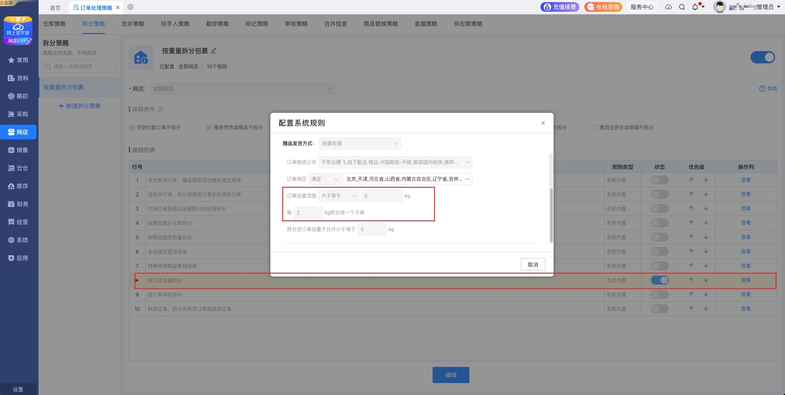
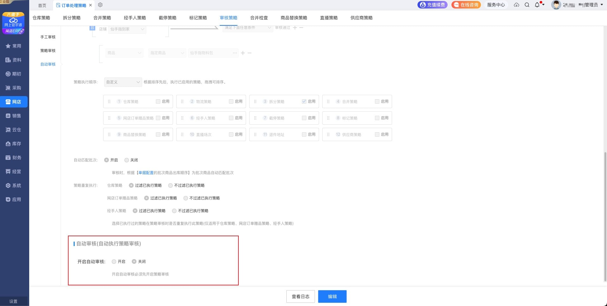
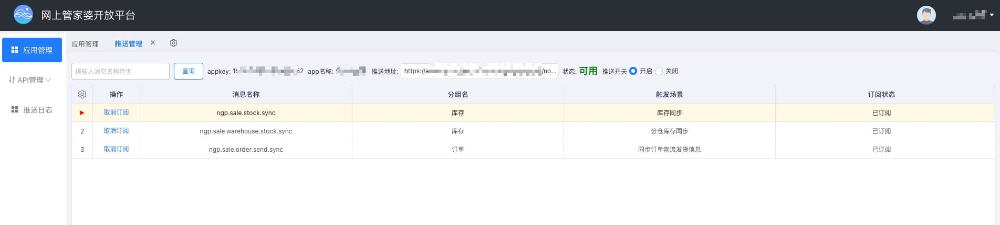

#### 管家婆云仓自动发货PHP
- 授权接入文档：https://ngpopen.wsgjp.com/#/document/1
- 接口文档：https://ngpopen.wsgjp.com/#/document/2

#### 说明
当前package包仅适用于自建商城对接云仓完成自动发货的动作，管家婆在两者之间起到衔接的作用。

#### 流程
- 1、购买【网上管家婆云进销存/网店ERP】+ 云仓(外接wms)功能
- 2、注册成为开发者（ISV）并创建应用
- 3、composer require mengdodo/ngpopen
- 4、env配置
  - `GUANJIAPO_APP_STATE` state参数，随便给个字母数字的组合
  - `GUANJIAPO_APP_KEY` ISV应用信息
  - `GUANJIAPO_APP_SECRET` ISV应用信息
  - `GUANJIAPO_MERCHANT_ID` 登录管家婆云进销存/网店ERP, 店铺id: 管家婆erp => 资料 => 店铺 => 网店 通过浏览器开发者工具查API接口中列表的元素ID
  - `GUANJIAPO_FREIGHT_CODE` 登录管家婆云进销存/网店ERP, 物流id: 管家婆erp => 资料 => 物流 => 物流公司 通过浏览器开发者工具查API接口中列表的元素ID
   
- 5、浏览器访问项目下的路径 `/ngp/getAuth` ,将获取的url再次贴入浏览器地址栏回车访问并完成网页授权，完成授权后会打印 access_token 等信息，之后关闭浏览器。
- 6、开始对接API
```php
// 自建商城发货API
// https://ngpopen.wsgjp.com/#/document/2
// 1、先查询出管家婆中对应的商品信息（前提已经在管家婆中完成新增）`线上商品id` `线上商品名称 fullName` `线上商品skuid`
$goods = app('ngpSdk')->pTypeList(["pageSize" => 10, "pageIndex" => 1]);

// 2、提交订单到管家婆 【文档 14.2. 网店销售单上载】
$res = app('ngpSdk')->eshopSaleOrderUpload($data);

// $data 数据
array:2 [▼ 
  "otypeId" => 15500000000000000 //店铺id
  "orders" => array:1 [▼
    0 => array:15 [▼
      "tradeId" => "20250314105739724540"
      "tradeStatus" => 2
      "buyerMessage" => ""
      "tradeCreateTime" => "2025-03-14 10:57:39"
      "tradePayTime" => "2025-03-14 10:57:43"
      "freightCode" => "zto"
      "tradeType" => 0
      "tradeTotal" => "117.00"
      "sellerPreferentialTotal" => 0
      "platformPreferentialTotal" => 0
      "selfDeliveryMode" => 1
      "deliverType" => 2
      "eshopBuyer" => array:6 [▼
        "customerReceiver" => "张三"
        "customerReceiverMobile" => "13111111111"
        "customerReceiverProvince" => "湖北省"
        "customerReceiverCity" => "荆门市"
        "customerReceiverDistrict" => "掇刀区"
        "customerReceiverAddress" => "某某小区3-123"
      ]
      "invoice" => array:1 [▼
        "invoiceRequired" => false
      ]
      "orderDetails" => array:1 [▼
        0 => array:8 [▼
          "platformNumId" => "1558527555933443999" // `线上商品id`
          "platformProductName" => "仙手指物料包" // `线上商品名称 fullName`
          "oid" => "orderItem_141"
          "picUrl" => "https://www.xxx.com/images/20250301104720.jpg"
          "platformSkuId" => "15591111111111111" // `线上商品skuid`
          "tradeTotal" => "117.00"
          "unitQty" => 2 // 商品数量
          "refundStatus" => 0
        ]
      ]
    ]
  ]
]

// 提交成功后前往管家婆erp：网店 => 平台原始订单池 查看记录
```
- 7、云仓自动发货(自动拆包多个快递发货)
  - 管家婆erp：网店 => 平台原始订单池 查看记录
  - 管家婆erp：网店 => 订单处理策略 => 拆分策略 => 启用【按订单估重拆分】
  - 管家婆erp：网店 => 订单处理策略 => 审核策略 => 自动审核(自动执行策略审核) => 开启自动审核





- 8、云仓发货记录查询
  - 云仓 => 出库任务

- 9、物流状态回传
  - 登录 开发者（ISV）开发者后台
  - 选择应用 => 推送管理 => 填写线上项目用于接收物流信息回传的接口，并点击开启，最后订阅消息推送
```php
// 物流回传示例
{
	"orderId": "2025011111111111",
	"splitSend": true,
	"freightInfoList": [
		{
			"freightName": "圆通速递",
			"freightCode": "yto",
			"freightBillNo": "YT111111111"
		}
	],
	"subItems": [
		{
			"subOrderId": "orderItem_141",
			"qty": 2.0
		}
	],
	"messageId": "32607736",
	"appkey": "xxxxxxxx",
	"method": "ngp.sale.order.send.sync",
	"timestamp": "1741944685431",
	"sign": "xxxxxxxx",
	"accessToken": "xxxxxxxx"
}

// 项目需要响应 {"code": 0,"message": "success"}
```


